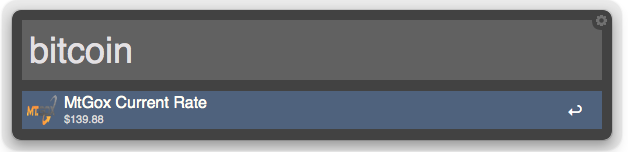

# Bitcoin workflow for Alfred v2
A configurable workflow for Alfred v2 which opens your bitcoin wallet and relevant bitcoin websites

## Installation

You can install this workflow by downloading the [Bitcoin.alfredworkflow](https://github.com/spudstud/alfred-bitcoin-workflow/raw/master/Bitcoin.alfredworkflow)
dragging it onto the Alfred Workflow screen.

## Configuration

You will need to change the application from "multibit" to your bitcoin wallet
You will need to change the pool from "mining.bitcoin.cz" (slush) to your bitcoin mining pool

## About

This workflow is developed by Spencer O. 
[spuder.wordpress.com](https://spuder.wordpress.com)

[spudstud@github](https://github.com/spudstud)

[@spencer450](https://twitter.com/spencer450)
